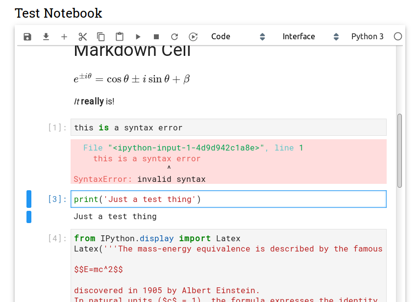

=====================
The Simplest Notebook
=====================

.. image:: https://mybinder.org/badge_logo.svg
   :target: https://mybinder.org/v2/gh/yuvipanda/simplest-notebook/master?urlpath=%2Fsimplest

The simplest possible Jupyter Notebook interface.

Sometimes, you want only the notebook you are working on your screen,
and nothing else. You want no configurability, no knobs to turn,
no panes to explore. The simplest notebook is for you!

The primary target audience is folks who are teaching introductory
classes with Jupyter Notebooks - students in these classes might
find `JupyterLab <https://github.com/jupyterlab/jupyterlab>`_ too
intimidating.

Install
=======

The Simplest Notebook can be installed with ``pip``.

.. code::

    pip install simplest-notebook

Once installed, you can open simplest notebook with

.. code::

    jupyter simplest-notebook